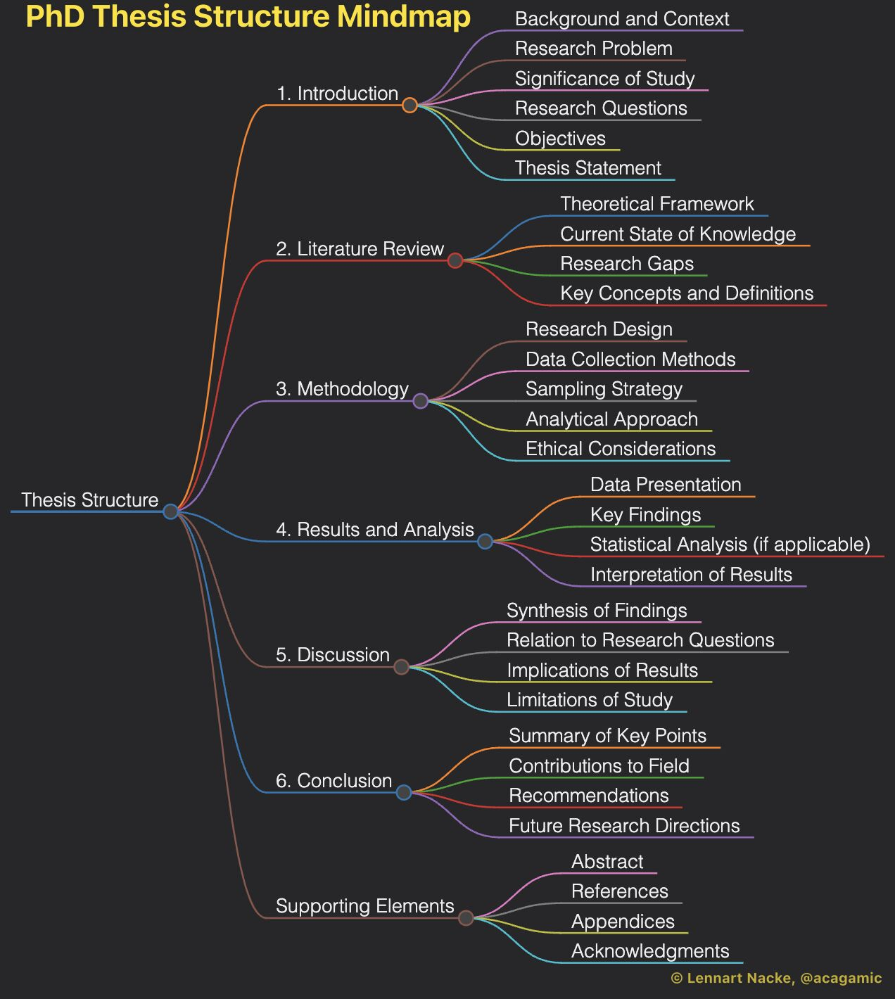
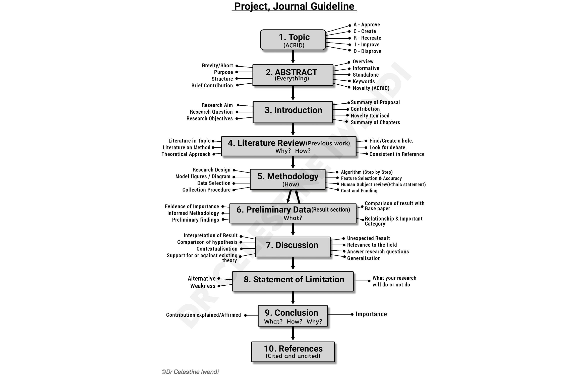

# myPhD

<!-- [](https://www.wsnmagazine.com/secrets-for-research-excellence/) -->

[](https://www.wsnmagazine.com/secrets-for-research-excellence/)

## Funding

## Environment

### Installing Java SE Platform (JDK 23)

- Download jdk installer from Oracle [website](https://www.oracle.com/in/java/technologies/downloads/) and install default
- Go to the folder `C:\Program Files\Java\jdk-23\bin` and copy the path
- Open **Environmental Variables** and go to the **Path** in the **System Variables**
- Paste the `C:\Program Files\Java\jdk-23\bin` in the Path
- Then create a new system variable called `JAVA_HOME` with the value `C:\Program Files\Java\jdk-23`

- Open `cmd` pr `powershell` and run

  - `java -version`

    ```shell
    java version "23.0.1" 2024-10-15
    Java(TM) SE Runtime Environment (build 23.0.1+11-39)
    Java HotSpot(TM) 64-Bit Server VM (build 23.0.1+11-39, mixed mode, sharing)
    ```

# International Standards

## [W3C](https://www.w3.org/TR/)

The World Wide Web Consortium (W3C) develops standards and guidelines to help everyone build a web based on the principles of accessibility, internationalization, privacy and security.

1. [SPARQL 1.1](https://www.w3.org/TR/sparql11-overview/)
2. [RDF](https://w3c-cg.github.io/rdfsurfaces/)
3. [RDF 1.1](https://www.w3.org/TR/rdf-concepts/)

## [OGC](https://www.ogc.org/publications/)

1. [asGeoJSON](https://defs.opengis.net/vocprez/object?uri=http%3A//www.opengis.net/def/function/geosparql/asGeoJSON) : Converts a given geometry to an equivalent GeoJSON representation. Coordinates are converted to the CRS84 coordinate system, the only valid coordinate system to be used in a GeoJSON literal.

2. [GeoJSON Specs](https://stevage.github.io/geojson-spec/)

## ISO

## Open Street Maps (OSM)

1. [OSM File Formats](https://wiki.openstreetmap.org/wiki/OSM_file_formats)
2. [osm2pgsql](https://osm2pgsql.org/)

# Relational Data

## Vector Data

Relational data with additional column representing geometric features of real world feature.

- [GDAL Vector Drivers](https://gdal.org/en/latest/drivers/vector/index.html)

1. https://www.statsilk.com/maps/download-free-shapefile-maps
2. https://gadm.org/data.html
3. https://www.naturalearthdata.com/downloads/
4. https://hub.arcgis.com/datasets/esri::world-cities/about
5. https://arthworks.stanford.edu/
6. https://www.geonames.org/
7. https://www.efrainmaps.es/english-version/free-downloads/world/
8. https://download.geofabrik.de/
9. https://terraformer-js.github.io/glossary/

### Grammar of Shapefiles

1. https://www.e-education.psu.edu/natureofgeoinfo/c4_p5.html
2. https://www.loc.gov/preservation/digital/formats/fdd/fdd000280.shtml

### Visualization

1. [GeoJSON.io](https://geojson.io/#map=2/0/20)
2. [WKT Playground](https://clydedacruz.github.io/openstreetmap-wkt-playground/)
3. [CovJSON](https://covjson.org/playground/)

## CityGML

- [CityGML](https://www.cityjson.org/) can be represented in [CityJSON](https://www.cityjson.org/)

- CityJSON File [Viewer](https://ninja.cityjson.org/)

### Downloading CityGML data from [OpenDATA](https://geodaten.bayern.de/opengeodata/OpenDataDetail.html?pn=lod2) using GitBash

- Open **GitBash** inside the folder and execute the following shell script `get-munich-citygml.sh` using `$ sh get-munich-citygml.sh`

  ```sh
  #!/bin/bash

  for LONG in `seq 674 2 680`
  do
      for LAT in `seq 5332 2 5342`
      do
          wget "https://download1.bayernwolke.de/a/lod2/citygml/${LONG}_${LAT}.gml"
      done
  done
  ```

  - Edit the Range of `LONG` and `LAT` to download more gml files

### Converting CityGML to CityJSON

- CityJSON format is much smaller than CityGML for representing city data.

- Follow the instructions at this [page](https://www.cityjson.org/tutorials/conversion/#conversion-citygml---cityjson)

### Merging CityJSON files using _CityJSON/io ([cjio](https://github.com/cityjson/cjio?tab=readme-ov-file)_)

- Convert each `.gml` file to `.city.json` file
- Go to this [page](https://cjio.readthedocs.io/en/latest/includeme.html)
- Open cmd and run the following to download `cjio`

  - $` pip install cjio`

  - ```sh
    Defaulting to user installation because normal site-packages is not writeable
    Collecting cjio
      Downloading cjio-0.9.0-py2.py3-none-any.whl.metadata (11 kB)
    Requirement already satisfied: numpy in c:\users\arkag\appdata\roaming\python\python310\site-packages (from cjio) (1.23.4)
    Requirement already satisfied: Click>=8.1.0 in c:\users\arkag\appdata\roaming\python\python310\site-packages (from cjio) (8.1.7)
    Requirement already satisfied: colorama in c:\users\arkag\appdata\roaming\python\python310\site-packages (from Click>=8.1.0->cjio) (0.4.6)
    Downloading cjio-0.9.0-py2.py3-none-any.whl (49 kB)
    Installing collected packages: cjio
    Successfully installed cjio-0.9.0
    ```

  - `cjio --help`

  - Usage examples:

    ```sh
          cjio myfile.city.json info
          cjio myfile.city.json subset --id house12 save out.city.json
          cjio myfile.city.json crs_assign 7145 textures_remove export --format obj output.obj
          cat mystream.city.jsonl | cjio stdin info
    ```

  - Run the following script to join let's say 4 CityJSON files

    ```sh
    $ cjio 676_5336.json merge 680_5334.json merge 688_5334.json merge 688_5336.json save out.city.json
    ```

# Raster Data

- [GDAL Raster Drivers](https://gdal.org/en/latest/drivers/raster/#)

1. Application for Extracting and Exploring Analysis Ready Samples ([AρρEEARS](https://appeears.earthdatacloud.nasa.gov/))
2. [Copernicus](https://www.copernicus.eu/en/access-data)
3. [NASA EarthData](https://www.earthdata.nasa.gov/)
4. [NASA STRM](https://www.earthdata.nasa.gov/data/instruments/srtm)
5. [SRTM 1 Arc Sec](https://doi.org/10.5066/F7PR7TFT)
6. [SRTM 30m](https://dwtkns.com/srtm30m/)
7. [TessaDEM](https://tessadem.com/) is a near-global 30-meter Digital Elevation Model (DEM).
8. [OpenEO](https://openeo.org/)

### Visualization

1. [Topographic Viewer](https://en-us.topographic-map.com/)
2. [GeoTIFF Viwer](https://app.geotiff.io/)

# Graph Data

1. [GraphDB](https://graphdb.ontotext.com/documentation/10.8/)

# Experiments
